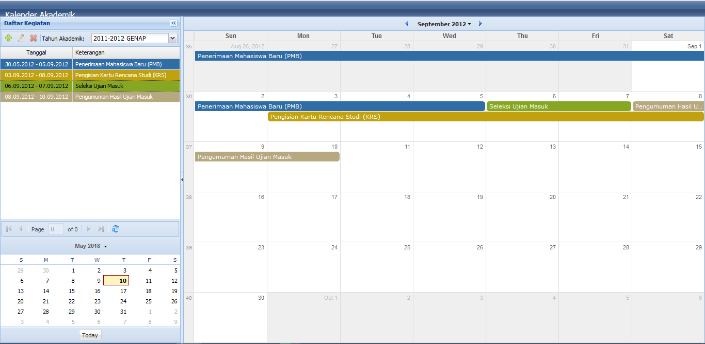

Agenda_Kegiatan
===============

Adalah aplikasi pencatatan jadwal kegiatan suatu lembaga atau organisasi atau kegiatan akademik. dibuat menggunakan extjs 4 dengan rest api json menggunakan php native.

Struktur File
===============

www (document root) 
&emsp; ext-4.2.1 (framework extjs versi 4.2.1 dapat didownload di sencha.com) 
&ensp; agenda_kegiatan

Pengistallan Database
======================
- Buat database mysql dengan nama agenda_kegiatan.
- Import file agenda.sql pada database agenda_kegiatan.
- Sesuaikan parameter username dan pasword mysql pada file /php/initial.php

